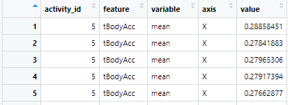

### Import the library

---

The important libraries for this code

```
library(data.table)
library(dplyr)
library(tidyr)
```

### Create variables to save the paths to data

---

- **x_dirs** : the list contains the paths to **X** data

- **y_dirs** : the list contains the paths to **y** data

- **activity_labels_dir** : the path to **activity labels** data

- **features_dir** : the path to **features** data

```
x_dirs <- list(xtrain = './UCI HAR Dataset/train/X_train.txt',
               xtest = './UCI HAR Dataset/test/X_test.txt')

y_dirs <- list(ytrain = './UCI HAR Dataset/train/y_train.txt',
              ytest = './UCI HAR Dataset/test/y_test.txt')
activity_labels_dir <- './UCI HAR Dataset/activity_labels.txt'
features_dir <- './UCI HAR Dataset/features.txt'
```

### Read data

---

#### Read features and activities

```
features <- read.table(features_dir)
activities <- read.table(activity_labels_dir)
```

#### Read X and y data

- Using **read\.table** to read table data from .txt file

- Using **lapply** to create a list that contains the list of table data

- Using **rbind** to concatenation list of table data to make one table data

```
x <- do.call(rbind, lapply(x_dirs, read.table))
y <- do.call(rbind, lapply(y_dirs, read.table))
```

#### Rename column names of **X** table follow by **feature names**

```
names(x) <- features$V2
```

#### Extracts only the measurements on the mean and standard deviation for each measurement

```       
is.cols <- grepl('mean()', features$V2) | grepl('std()', features$V2)
x <- x[, is.cols]
```

#### Make full data set by creating a new column named **x$activity_id**

```       
x$activity_id <- y$V1
```

#### Create tidy data set

First, we use the **gather** and **separate** function to create a new table with
the following format 



```
x %>%
        gather(cols, value, -activity) %>%
        separate(cols, c('feature', 'measurement', 'axis'))
```

According to [Tidy data paper](https://www.jstatsoft.org/article/view/v059i10), we need 3 conditions for a data is tidy data:

1. Each variable forms a column

2. Each observation forms a row

3. Each type of observational unit forms a table

We see that the values **activity_id = 5, feature = tBodyAcc, variable = mean, axis = X** is repeated 5 times in that picture, it **doesn't satisfy** 3rd condition.

We fix it by creating a new table named **measurements**. This table contains all unique values for **activity_id, feature, variable, axis**, and a new column named *measurement_id* to represent each measurement. The table format is 


```
measurements <- x %>%
        select(activity_id, feature, variable, axis) %>%
        unique()
measurements <- mutate(measurements, measurement_id=seq(1:dim(measurements)[1]))
```

Finally, we create a new table named **values**. This table contains the **measurement_id** representing each measurement and its **value**. The table format is 


```
values <- measurements %>%
        merge(x) %>%
        select(measurement_id, value)
```

In detail, we explain in the [codebook.Rmd](codebook.Rmd)

### Save data to file

---

#### We create a new folder that contains all data named **my_data**

```       
save_dir <- './my_data'
if(!dir.exists(save_dir)){dir.create(save_dir)}
```
#### We save all data to that folder

```
write.table(activities, sprintf('%s\\activities.txt', save_dir), row.names = FALSE, col.names = FALSE)
write.table(measurements, sprintf('%s/measurements.txt', save_dir), row.names = FALSE, col.names = FALSE)
write.table(values, sprintf('%s/values.txt', save_dir), row.names = FALSE, col.names = FALSE)

```
